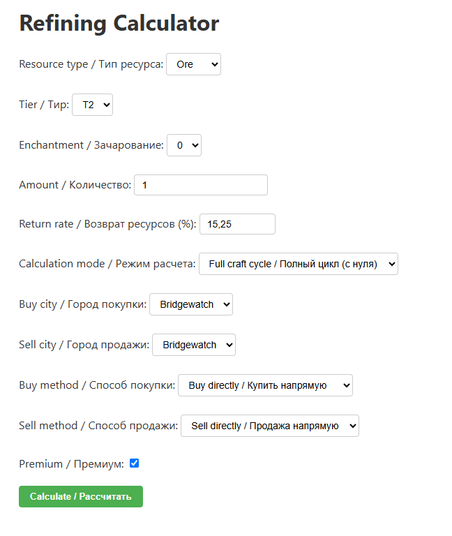
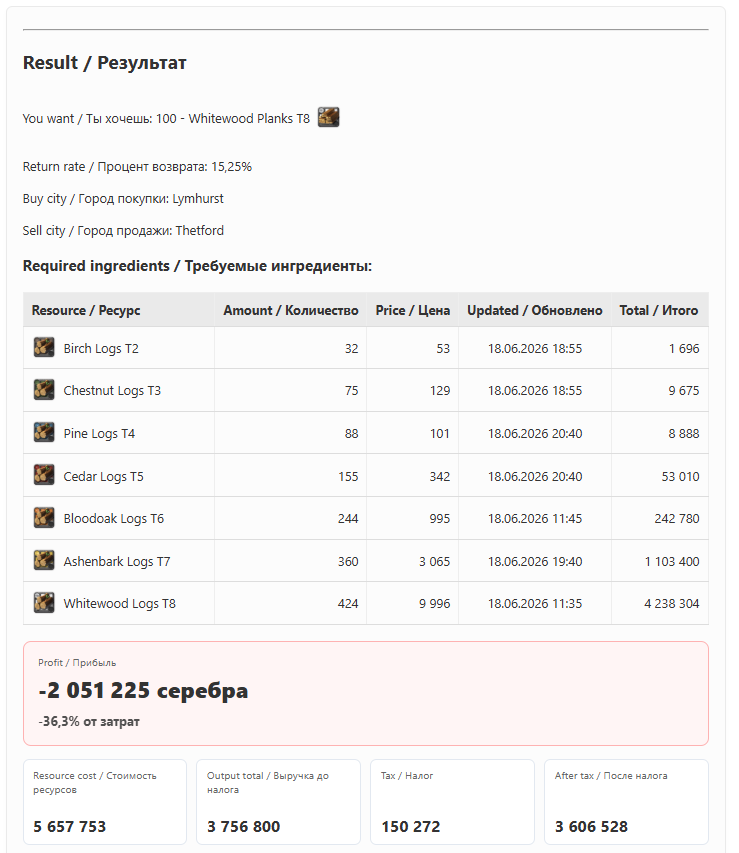
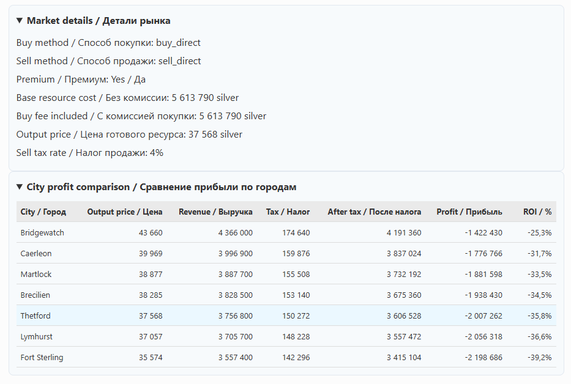

### 🎮 Albion Online Refining & Crafting Calculator

### Django-приложение для рассчета переработки ресурсов, рыночной стоимости, налогов и прибыли в ММОРПГ Albion Online.

### ✨ Возможности проекта:
- Расчёт переработки ресурсов
- Полный цикл переработки до сырья
- Расчёт только последнего шага
- Учёт возврата ресурсов
- Выбор категории, тира и зачарования
- Цены по городам
- Обновление цен через Albion Online Data API
- Покупка и продажа через ордера
- Учёт премиума и рыночных налогов
- Расчёт прибыли и ROI
- Сравнение прибыли по городам
- Админ-панель для ресурсов и рецептов

❗ Модуль крафта предметов в настоящее время находится в разработке. ❗

### 🖼️ Скриншоты: 

# Refining calculator

# Result

# Market details & City Comparison

### ⚙️ Используемы Технологии:
- Python
- Django
- SQLite
- HTML
- CSS
- Requests 
- Pillow
- Albion Online Data API

### Архитектура проекта:
- `resources` — ресурсы, тиры, зачарования и категории
- `refining` — рецепты переработки и расчёт полного цикла
- `market` — получение и хранение рыночных цен
- `crafting` — предметы, артефакты и рецепты крафта
- `albion_proj` — настройки Django-проекта

albion_proj/
├── albion_proj/        # настройки Django-проекта
├── crafting/           # предметы, артефакты и рецепты крафта
├── docs/               # скриншоты для README
├── market/             # цены и работа с API
├── refining/           # переработка и расчёты
├── resources/          # модели ресурсов
├── .gitignore
├── manage.py
├── README.md
└── requirements.txt

### Логика работы переработки (Refining)

Рецепт переработки состоит из результата и нескольких ингредиентов.
Пример:
T4 Planks:
- 1 × T3 Planks
- 2 × T4 Logs

В режиме полного цикла переработанные ингредиенты рекурсивно раскладываются до сырых ресурсов.

T4 Planks
├── T3 Planks
│   ├── T2 Planks
│   │   └── T2 Logs
│   └── T3 Logs
└── T4 Logs
